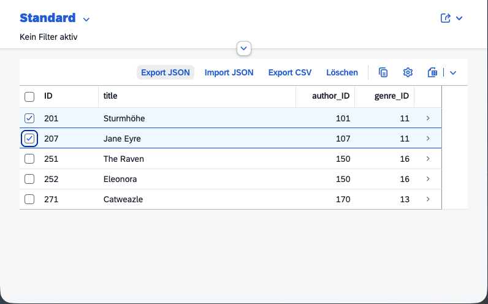

# 📚 Bookshop Deep Export / Import (CAP 9.4 + Fiori Elements V4)



A complete end-to-end **SAP CAP (Node.js 9.4)** example showing:

- **Generic deep export** of entities (using reflection + CAP streaming DB API)
- **Streaming deep import** via incremental JSON parsing
- **Fiori Elements V4 List Report** integration with file upload and JSON download
- **Future-ready** for CAP 9.5 streaming inserts

## ⚙️ Features

| Feature                       | Description                                                                        |
| ----------------------------- | ---------------------------------------------------------------------------------- |
| 🔄 **Deep Export (streamed)**            | Exports selected entities including all `composition of` relationships (any depth) |
| 💾 **Deep Import (streamed)** | Imports large JSON files via incremental parsing without memory overload           |
| 🧱 **CAP Streaming DB API**   | Uses `query.localized.stream()` for efficient JSON streaming                       |
| 💡 **CAP 9.5-ready**          | Clearly marked upgrade points for `INSERT.stream()`                                |
| 🖥️ **Fiori Elements V4 UI**   | Two toolbar buttons (Export / Import) integrated into the List Report              |
| 🔒 **Low memory footprint**   | Handles multi-MB/GB JSON without full in-memory parse                              |

---

## 🚀 Getting Started

### 1️⃣ Install Dependencies

```bash
npm install
```

### 2️⃣ Start the CAP Server

```bash
npm run watch-bookshop
```
    Runs cds watch --open bookshop/webapp/index.html?sap-ui-xx-viewCache=false

### 3️⃣ Open the Fiori App

[http://localhost:4004/bookshop/webapp/index.html?sap-ui-xx-viewCache=false](http://localhost:4004/bookshop/webapp/index.html?sap-ui-xx-viewCache=false)

## 💡 Usage

### 🔹 Deep Export

1. Open the Books List Report
2. Select one or more rows
3. Click Export Deep (JSON)
4. A JSON file (Books.json) will be downloaded

Each exported object includes its deep composition tree (reviews, authors, …).

### 🔹 Deep Import
To be able to import a download Book, you have to delete it first!

1. Click Import Deep (JSON)
2. Choose the previously exported file
3. CAP streams the file object-by-object via stream-json
4. each entity (and its subnodes) is inserted through CAP deep insert
5. You’ll see a toast with the number of imported entities


## 🧾 License
MIT — free to use, modify and extend.

✨ Author
Holger – SAP Developer / CAP Expert
(Generated with ❤️ and caffeine by GPT-5)
